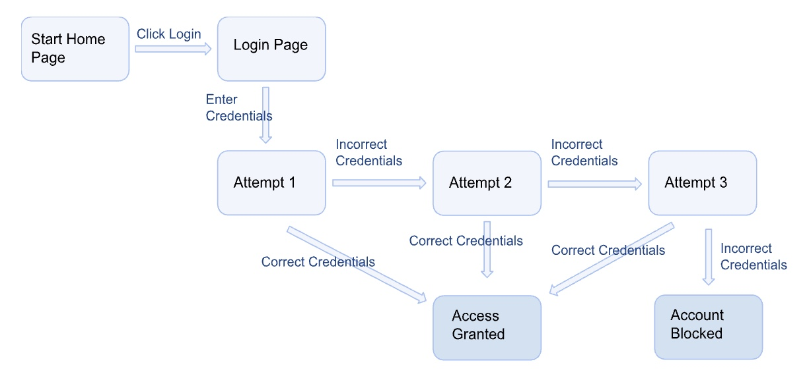

# Test Case Analysis - State Transitions

## Introduction

State transitions, or better said, state transition testing, as it relates to software engineering is a type of black box testing technique. You are basically testing the program to see if it behaves like it should during all of it's states and all transitions between those states, based on inputs and events that occur.

## Table / Diagram Example

Here's a good example of a diagram that you could make with expected states and transitions to follow during a test:

The blocks are expected states and the arrows are expected transitions.

## When Testing Should Occur

This test is most impactful when testing front end programs, because you have a user interface that makes it pretty clear what state the program is in and how it acts during transitions. You could also use this type of testing on programs that aren't on the front end, but they should have clear indications of what state they are in and what they do when they transition to other states. These tests are also great at finding errors in complex workflows because it helps layout all the possible states and transitions that may have been missed or neglected by the programmer.

## Limitations

While state transition testing is great for complex workflows, the complexity needs to stop somewhere for this type of testing to work. If you have an infinite number of states and transitions, it would be impossible to make a diagram that follows all possible states and transitions. This type of testing would also not do very well on back-end programs where the state of the program is usually difficult to visualize or identify.

## AI Discussion

- Again, no hallucinations.
- Sites used to verify AI output:
    - https://www.geeksforgeeks.org/software-engineering/state-transition-testing/
    - Diagram: https://testsigma.com/blog/state-transition-testing/
- One prompt I used: "why is this sort of testing good at complex workflows?" This prompt outputted actually very valuable insight that I would've never thought about! I included some of the response in the "When testing should occur" section.
